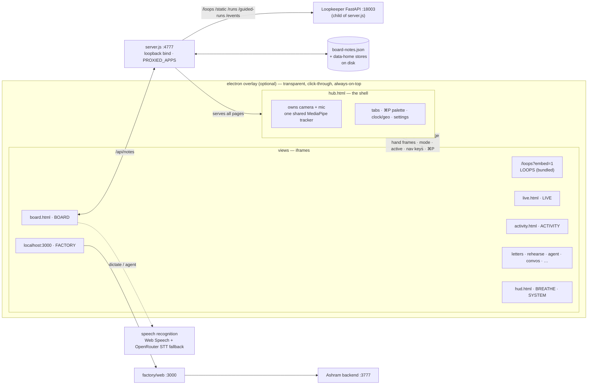

# VALINOR

> your desktop, but it can see your hands. a hub of views that live over
> everything: loopkeeper for operating loops, a board that listens and agents
> for you, a teleprompter that follows your voice, breathe when you're spun up.
> other apps plug in via a same-origin reverse proxy — valinor as the
> consolidation screen. built in single sittings.
> built in single sittings, by Savar Sareen.

Webcam hand-tracking (MediaPipe) drives a breathing pacer, a voice-following
teleprompter, spatial notes, letters, and a brick-breaker you play with your
hand — served by one zero-dependency Node server, optionally overlaid on the
whole screen via a transparent click-through Electron shell. Loopkeeper (and
future apps) embed as same-origin iframes through a small `PROXIED_APPS` config.

## Architecture



Every view loads `hub-client.js`: embedded in the hub it reuses the hub's
camera stream and hand frames; opened standalone it acquires its own.

Loopkeeper lives under `./loopkeeper` and is started as a managed child of
`server.js` (loopback `:18003`), then registered in `PROXIED_APPS` for same-origin
embedding. FACTORY embeds the Next.js UI cross-origin at `:3000` — that app
proxies its own APIs to the Ashram backend on `:3777`.

## Surfaces

| Page | What it is |
|---|---|
| `hub.html` | Shell — camera/mic + shared tracker; tabs, **⌘P** command palette, nav classic/drawer, clock+geo tip (click to copy), settings / restart |
| `/loops?embed=1` | **LOOPS** — Loopkeeper (bundled child on `:18003`) |
| `http://localhost:3000` | **FACTORY** — Ashram Next.js UI; needs backend `:3777` + UI `:3000` |
| `live.html` | Live session / dictate surface |
| `activity.html` | Machine + activity feed (hw strip, Sauron-aware) |
| `board.html` | Spatial notes — infinite canvas; voice → agent |
| `letters.html` | Letters as paper cards (content stays local; data-home or gitignored `letters/`) |
| `rehearse.html` | **REHEARSE** — mock interview partner: voice interviewer + coach debrief + TTS. Persona is config-driven (copy `rehearse.config.example.json` to `rehearse.config.json`); works out of the box with built-in generic defaults |
| `ingrain.html` | **INGRAIN** — voice spaced-repetition; study prose → quiz, cross-session strength, custom decks |
| `index.html` | GAME — brick breaker (hand paddle) |
| `hud.html` | BREATHE + SYSTEM |
| `agent.html` / `convos.html` | Agent trace + past sessions |
| `messages.html` | Network CRM / outreach drafts (needs optional env paths) |
| `adventures.html` / `oss.html` / `logact.html` / `buzz.html` | Prototypes / plan stubs |
| `server.js` | Zero-dep HTTP on `:4777` (default bind `127.0.0.1`) |
| `electron-main.js` | Transparent always-on-top overlay |
| `hub-client.js` | Embed contract |

## Run

```sh
cp .env.example .env   # add OPENROUTER_API_KEY if you use agent / STT fallback
npm install            # electron only
npm run server         # http://127.0.0.1:4777  (+ LOOPS via /loops)
npm run overlay        # electron overlay
npm run hud            # both

# Optional — Factory tab
npm run factory        # Ashram backend :3777 (expects ../factory)
npm run factory-ui     # Next.js UI :3000 (expects ../factory/web)

# Optional — keep :4777 alive
npm run watch
```

Bind defaults to loopback. To expose on LAN: `VALINOR_BIND=0.0.0.0 npm run server`.

Without Factory running, every other tab still works. LOOPS boots with the
server (first run may create `loopkeeper/venv`).

## Local / private data

These stay off git (see `.gitignore` + `.env.example`):

- `.env`, `loopkeeper/.env`
- `crm.json`, `drafts.json`, `message-profile.json`, `board-notes.json`,
  `live-session.jsonl`, `live-conversations.json`, `agent-usage.jsonl`,
  `rehearse-sessions.jsonl`
- `letters/*` (legacy repo folder kept via `.gitkeep`; fresh installs write to
  data-home `letters/`) + letter revision history
- writing stores (`writing-voice.md`, `writing-*.json`, prompt-run logs)
- `rehearse.config.json` (per-user persona config)
- `loopkeeper/*.db`, `loopkeeper/venv/`, design-run artifacts
- `tts/venv/`, `tts/models/`, `tts/tmp/`

Optional CRM paths (`NETWORK_DB_PATH`, `NETWORK_PEOPLE_DIR`, `CHAT_DB_PATH`) have
**no machine defaults** — unset means messages degrade empty; `backfill-crm.js`
exits until you set them.

`notes.json` is legacy and frozen — the server reads it once (one-time import)
and never writes it. Runtime board state lives in gitignored `board-notes.json`.

## User data & updating

Every server-side store resolves through `data-home.js`:

1. an explicit per-store env var (see `.env.example`) when set;
2. the repo-local file, when it already exists (backward compat — existing
   installs keep working exactly where their data is);
3. `VALINOR_DATA_DIR` (or `~/.valinor/`) for all **new** writes.

So: fresh installs never write state into the repo, and `git pull` is safe —
updating the code can never touch user data. Browser `localStorage` prefs
(hub look, INGRAIN SRS, rehearse UI state) live outside git by nature and
survive updates untouched.

Store-format rule for all future changes: readers stay backward tolerant
(ignore unknown fields, fill defaults); migrations are additive and
copy-based, never destructive rewrites; any shape change ships with a version
note plus migration path.

## Backup

Back up these (everything else is code or caches):

- `~/.valinor/` (or your `VALINOR_DATA_DIR`) — session logs, usage, board notes
- `.env` — keys + path overrides
- `letters/` — your letters (legacy repo folder, or data-home `letters/`)
- repo-local `*.json` / `*.jsonl` stores, if you have them from before data-home
  (`drafts.json`, `crm.json`, `board-notes.json`, `live-*.json*`, writing stores)

## Shared state

JSON stores sync through `/api/<name>`. Claude Code can read/write those files
directly. See `ROADMAP.md` and `plans/` for what's next.

## License

Apache License 2.0 — see `LICENSE`.

## Updates

Newest first. Add a line here with each meaningful push.

### 2026-09-12
- **REHEARSE — config-driven persona**: interviewer/candidate/role/banks/checklist
  now resolve `REHEARSE_CONFIG` env → `rehearse.config.json` (gitignored) →
  built-in generic defaults.
  Prompt v1.2; picker subtitle renders from `GET /api/rehearse/config`.
- **DATA-HOME — user data separated from code**: every server-side store resolves
  explicit env → repo-local-when-present → `VALINOR_DATA_DIR`/`~/.valinor/`
  (`data-home.js`). Board notes migrate `notes.json` (frozen, legacy import) →
  `board-notes.json`; generic `POST /api/<name>` writer allowlisted to `drafts`.
  Fresh installs never write state into the repo; `git pull` is data-safe.

### 2026-09-12
- **EXECUTE — scrubbed the Wave 1 time-boxed flow**: the "I have N minutes" ranked surface,
  prestage artifacts, and the three exits (do-now / agent-stub / schedule) never worked
  end-to-end (stubbed agent, silent prestage failures, empty ranking metadata), so they're
  out — `execute.html` + `server.js` + `execute-server.js` stripped back to plain
  Backlog → Active → Review → Done (scan + start + proof + review), `prestage-server.js`
  deleted. Render still records `action_type` / `duration_bucket` for a future redesign.

### 2026-09-12
- **WRITING — voice profile system overhaul**: the ghostwriter now sounds like the writer
  instead of generic "good writing."
  - **Few-shot rewrites**: the rewrite engine now injects verbatim excerpts of the writer's own
    writing as the texture to match (research is clear: demonstrations beat descriptions),
    and is told to trust the excerpts over the distilled profile when they conflict.
  - **Forensic profile builder**: the build prompt forces quoted, specific observations
    (rhythm, punctuation, openings/closings, tics) and BANS generic writing-teacher advice;
    adds a "Signature moves & phrases" section and writer-specific anti-tells.
  - **Model → `anthropic/claude-opus-4.7`** (from `openai/gpt-4o`) — Claude is far better at
    nuanced voice. Override with `WRITING_MODEL`; `WRITING_BUILD_MODEL` for the build pass.
  - Corpus caps raised (40k→120k total, 6k→16k/sample) so long pieces aren't gutted.

### 2026-09-10 (Wave 2)
- **INGEST → EXECUTE — auto-render on capture**: a capture now renders into an EXECUTE
  suggestion automatically, in the background (fire-and-forget after the capture response
  flushes — capture stays instant), killing the manual Enhance → Add to backlog → Scan
  ingest chain. Render sets `intent`, `outcome`, `action_type`, and `duration_bucket` (so
  the ranker has what it sorts on). Non-actionable notes are skipped (persisted skip-set,
  no bare suggestions, no re-billing). The manual "Scan ingest" button stays as the batch
  backstop. `scanIngest` was refactored into shared render helpers reused by both paths.

### 2026-09-10
- **EXECUTE — completion engine, Wave 1**: turns the manual task board into the
  activation-energy loop from the Valinor design spec (stages 3–5).
  - **Data model**: tasks gain `intent`, `action_type` (draft/reply/transact/schedule/
    errand/other), `duration_bucket`, `prestaged_ref`, `scheduled_block`, append-only
    `state_history`, and `outcome_meta` (time-to-completion). Legacy tasks backfill on read.
  - **Prestage** (`prestage-server.js`): builds the *actual artifact* — a real drafted
    reply/link/checklist — not a restatement. Reuses the draft-server drafting pattern.
  - **"I have N minutes" view**: `GET /api/execute/ranked?minutes=N` ranks startable tasks
    by activation-fit (deterministic, not learned) and lazily prestages the top 3.
  - **Three exits** (`POST /api/execute/exit`): do-now (opens the prestaged artifact),
    agent-does (stubbed — never sends/pays/books), schedule (sets a real time block).
  - Slice archetype is **draft/produce**, chosen from the real ingest store (774 captures).

### 2026-08-13
- **INGEST — Apple Photos + screenshots, and a big Apple Notes fix**:
  - **Pull from Apple Photos** (new button + picker modal): scans a recent window (48h
    default; 3d/7d/14d options), exports + thumbnails each candidate, and shows a
    preview grid with everything selected by default — untick what you don't want, then
    ingest. Each chosen photo is captioned by the vision model (title + description +
    keyword tags) so the agent can find it by content. New `apple-photos.js`; endpoints
    `/api/ingest/apple-photos/{scan,thumb,ingest}`.
  - **Screenshots auto-ingest**: recent Mac screenshots from `~/Pictures/Pics/Screenshots`
    (override `SCREENSHOTS_DIR`) are captioned and pulled in automatically on boot, bounded
    to a recent window + dedup by path (`SCREENSHOTS_SINCE_HOURS`, default 48; disable with
    `INGEST_SCREENSHOTS_SYNC=0`). New `screenshots.js`; shared `captionImage()` in
    `ingest-server.js`.
  - **Apple Notes pull fixed**: the importer read every property of every note one-by-one
    and always timed out at 120s (nothing ever imported). Now bulk-reads metadata and
    fetches bodies (chunked, per-note) only for new/changed notes — first sync ~30s, re-syncs
    ~0.4s. Ingest list now sorts by real `created` date (was filename order) and shows the
    year for non-current-year notes.
- **DRAW tab**: a real Excalidraw canvas (`draw.html`, UMD from CDN — no build step), theme
  synced to the hub, autosaving to localStorage. Groundwork for server-side, agent-readable
  drawings next.
- **Hub UX fixes**: INGEST (and other framed views) now sit below the top bar via a `framed`
  flag; the hold-to-talk mic hotkey works while any tab has focus (backtick forwarded from
  embedded views); the cursor-capture toggle no longer overlaps the mic bubble.
- **INGEST → PLAN → EXECUTE → REVIEW loop**: capture now stays a clean *note* — the
  tangible-outcome ("plan") step is no longer auto-run on every capture. Instead an
  **Enhance** button in the ingest detail view generates one tangible outcome on demand
  and pushes it to a backlog. New **EXECUTE** tab (`execute.html` + `execute-server.js`,
  private JSON store under the data home (`execute/`)): a Kanban board
  Backlog → Active → Review → Done. Start a task to run a timer, comment as you go, and
  close it only by attaching a screenshot proof — which moves it to Review where the agent
  asks a reflection question. Answering saves on the task and writes a `source: review`
  note back into INGEST, closing the loop.

### 2026-08-05
- **INGRAIN — enriched the compute decks**: fact-checked every module and wove in
  concrete anchor numbers + worked examples where they aid grokking — float bit-splits,
  the `6ND` GPT-3 example (~3×10²³ FLOPs), Chinchilla 70B/1.4T, ~16 bytes/param, the
  H100 roofline ridge point (~300 FLOPs/byte), NVLink 900 GB/s→1.8 TB/s, B200 8 TB/s,
  TPU v4 4096-chip pod, and Meta's Llama 3 405B failure cadence (419 interruptions /
  54 days on 16,384 H100s). Numbers verified against current sources.
- **INGRAIN — compute-interview curriculum**: eight new decks for compute roles
  at frontier labs — **Distributed training** (parallelism), **Numbers &
  precision**, **Memory & roofline**, **Interconnect & networking**, **Scaling &
  economics**, **Kernels & performance**, **Datacenter & scale**, and **Inside the
  accelerator** (GPU/TPU) — alongside the two-part **Training** / **Inference**
  decks. Curated `pairs` decks with sectioned study prose that cross-reference each
  other and the NVIDIA FLOPs numbers.
- **INGRAIN — real spaced repetition**: per-fact strength now persists across
  sessions (Leitner boxes in `localStorage`); each recall is graded (missed/revealed
  → demote, slow → hold, clean+fast → promote); sessions lead with your weakest and
  most-overdue facts; the summary shows a strength table + an honest next-review date
  instead of a fixed "come back tomorrow".
- **Topic editor**: **＋ Topic** authors custom `prompt = answer` decks (new generic
  `pairs` kind), persisted to `localStorage` and merged into the topic list; custom
  decks inherit the spaced-repetition scheduling.
- **Content**: GPU deck reframed around the ~2×-per-generation pattern, the
  H200-as-memory-refresh exception, ship years, an FP16/FP8/FP4 caveat, and **Vera
  Rubin (2026)**; Rome gains **Carrhae (53 BCE)** as the causal hinge; new
  two-part **Training** (Part 1: gradient descent, hill climbing, backprop,
  loss/optimizers, overfitting) and **Inference** (Part 2: tokens, attention,
  prefill/decode, TTFT, inter-token latency, KV cache, quantization, speculative
  decoding) decks that cross-reference the GPU numbers.

### 2026-07-29
- **Public OSS cut**: published to [sksareen/valinor](https://github.com/sksareen/valinor)
  (Apache-2.0). Local CRM paths stay env-only; letters/DBs/usage logs stay gitignored.
- **Hub UX**: always-visible clock + settings; classic vs drawer nav (≤5 tabs +
  slide-down all-tabs); **⌘P** tab palette; **⌘K** menu; **⌘J** Valinor status
  overlay (date · tz · location · IP · compromise placeholder); clock tip copy;
  appearance prefs (theme / scheme / font / size / density).
- **Surfaces**: activity / live expansions; convos tag collapse + mobile; agent
  usage metering; adventures / oss / logact / buzz stubs; Loopkeeper still
  bundled under `./loopkeeper`.
- **Proto-OSS hygiene**: Apache-2.0 `LICENSE`, root `.env.example`, loopback bind by
  default, scrub absolute home paths from CRM helpers, empty `notes.json`,
  ignore personal letters / local DBs / usage logs. See `plans/lightweight-oss.md`.

### 2026-07-28
- **FACTORY → Next.js UX**: tab embeds `http://localhost:3000` (Command Center)
  instead of the classic `src/web/index.html`. Needs `npm run factory` (:3777)
  + `npm run factory-ui` (:3000). Classic disk serve + API reverse-proxy removed.
- **LOOPS replaces TODO**: tab 1 embeds Loopkeeper via a generic `PROXIED_APPS`
  reverse proxy. Floating to-dos / `todos.json` removed; `hud.html` keeps
  BREATHE + SYSTEM only.
- **Loopkeeper bundled**: copied to `./loopkeeper`; `server.js` spawns it on
  `:18003` so LOOPS no longer depends on a separate `:8003` process.
- **Voice STT fallback**: board records audio and posts to `/api/transcribe`
  when `webkitSpeechRecognition` can't reach Google's cloud (Electron, etc.).

### 2026-07-05
- **GAME**: waves/orbs playground replaced with a simple brick breaker — hand steers the paddle, pinch launches, mouse fallback; levels speed up, no mic needed anymore.
- **LOOPS removed**: view deleted, hub back to 7 views (nav keys 1–7).

### 2026-07-01 — third push
- **Board**: infinite-canvas upgrade — wheel zoom + space-drag pan over a ~4.5-viewport world, marquee multi-select, undo (⌘Z), tidy clusters, top-left hint bar.
- **Hub contract**: views now get an `active` signal when shown/hidden — hidden views release live resources (dictation mics especially), so switching views can't leave a mic hanging.
- **Rehearse**: when embedded, composes its recording stream from the hub's shared camera+mic — no second device open, no extra permission prompts.
- **Server**: path-traversal hardening (decode + normalize before the root check).
- **HUD**: transient dictation preview text never persists to `todos.json`.

### 2026-07-01 — second push
- **Rebrand**: Kautilya HUD → **VALINOR**; Lato across every surface.
- **LOOPS**: new view (`loops.html`, key 7) — operating-reference cards with cyclical flow diagrams in a carousel.
- **HUD gestures rebuilt**: pinch-drag reprioritizes with live insertion (the order you see is the order you get); pinch-HOLD with a dwell ring completes — stray pinches can't finish anything by accident; grab hysteresis kills flutter-drops; fist filter for the double-pinch gesture.
- **HUD dictation**: voice quick-add with a "heard" pill; sync guard so a poll can't clobber state mid-drag, mid-dictation, or mid-save.
- **Hub**: 7 views with tabs + pop-out; README architecture diagram.

### 2026-07-01 — first push
- **HUD**: typed to-do quick-add input, MediaPipe pose tracking alongside hands, done/archive card states with show-completed toggle, delete.
- **Hub shell**: `hub-client.js` embed contract — hub owns camera/mic + one shared hand tracker, views run as iframes.
- **Rehearse**: teleprompter fixes — active line rides screen center; voice-follow is the default (waits for your words instead of timed scroll); word matcher walks every heard word with a jump guard so a mishear ("Admeta Superintelligent") can't skip lines; mic errors surface instead of failing silently.
- **Repo**: Electron overlay shell, `.gitignore`, first push to GitHub.
- Initial commit: hand-tracking playground, HUD with pinch gestures, todos bridge.
