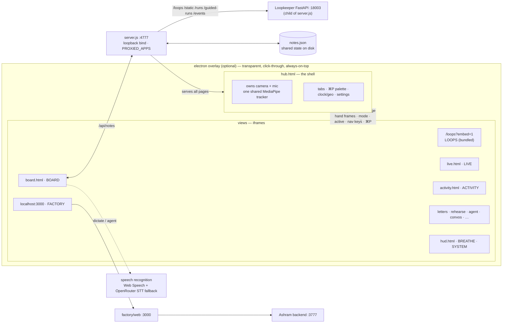

# VALINOR

> your desktop, but it can see your hands. a hub of views that live over
> everything: loopkeeper for operating loops, a board that listens and agents
> for you, a teleprompter that follows your voice, breathe when you're spun up.
> other apps plug in via a same-origin reverse proxy — valinor as the
> consolidation screen. built in single sittings.
> — savar

Webcam hand-tracking (MediaPipe) drives a breathing pacer, a voice-following
teleprompter, spatial notes, letters, and a brick-breaker you play with your
hand — served by one zero-dependency Node server, optionally overlaid on the
whole screen via a transparent click-through Electron shell. Loopkeeper (and
future apps) embed as same-origin iframes through a small `PROXIED_APPS` config.

## Architecture



Every view loads `hub-client.js`: embedded in the hub it reuses the hub's
camera stream and hand frames; opened standalone it acquires its own.

Loopkeeper lives under `./loopkeeper` and is started as a managed child of
`server.js` (loopback `:18003`), then registered in `PROXIED_APPS` for same-origin
embedding. FACTORY embeds the Next.js UI cross-origin at `:3000` — that app
proxies its own APIs to the Ashram backend on `:3777`.

## Surfaces

| Page | What it is |
|---|---|
| `hub.html` | Shell — camera/mic + shared tracker; tabs, **⌘P** command palette, nav classic/drawer, clock+geo tip (click to copy), settings / restart |
| `/loops?embed=1` | **LOOPS** — Loopkeeper (bundled child on `:18003`) |
| `http://localhost:3000` | **FACTORY** — Ashram Next.js UI; needs backend `:3777` + UI `:3000` |
| `live.html` | Live session / dictate surface |
| `activity.html` | Machine + activity feed (hw strip, Sauron-aware) |
| `board.html` | Spatial notes — infinite canvas; voice → agent |
| `letters.html` | Letters as paper cards (content stays local; `letters/` gitignored) |
| `rehearse.html` | Voice-following teleprompter + self-view |
| `index.html` | GAME — brick breaker (hand paddle) |
| `hud.html` | BREATHE + SYSTEM |
| `agent.html` / `convos.html` | Agent trace + past sessions |
| `messages.html` | Network CRM / outreach drafts (needs optional env paths) |
| `adventures.html` / `oss.html` / `logact.html` / `buzz.html` | Prototypes / plan stubs |
| `server.js` | Zero-dep HTTP on `:4777` (default bind `127.0.0.1`) |
| `electron-main.js` | Transparent always-on-top overlay |
| `hub-client.js` | Embed contract |

## Run

```sh
cp .env.example .env   # add OPENROUTER_API_KEY if you use agent / STT fallback
npm install            # electron only
npm run server         # http://127.0.0.1:4777  (+ LOOPS via /loops)
npm run overlay        # electron overlay
npm run hud            # both

# Optional — Factory tab
npm run factory        # Ashram backend :3777 (expects ../factory)
npm run factory-ui     # Next.js UI :3000 (expects ../factory/web)

# Optional — keep :4777 alive
npm run watch
```

Bind defaults to loopback. To expose on LAN: `VALINOR_BIND=0.0.0.0 npm run server`.

Without Factory running, every other tab still works. LOOPS boots with the
server (first run may create `loopkeeper/venv`).

## Local / private data

These stay off git (see `.gitignore` + `.env.example`):

- `.env`, `loopkeeper/.env`
- `crm.json`, `drafts.json`, `message-profile.json`, `live-session.jsonl`, `agent-usage.jsonl`
- `letters/*` (folder kept via `.gitkeep`)
- `loopkeeper/*.db`, `loopkeeper/venv/`, design-run artifacts

Optional CRM paths (`NETWORK_DB_PATH`, `NETWORK_PEOPLE_DIR`, `CHAT_DB_PATH`) have
**no machine defaults** — unset means messages degrade empty; `backfill-crm.js`
exits until you set them.

`notes.json` is the shared board store; keep it empty/`[]` in public trees.

## Shared state

JSON stores sync through `/api/<name>`. Claude Code can read/write those files
directly. See `ROADMAP.md` and `plans/` for what's next.

## License

Apache License 2.0 — see `LICENSE`.

## Updates

Newest first. Add a line here with each meaningful push.

### 2026-07-29
- **Public OSS cut**: published to [sksareen/valinor](https://github.com/sksareen/valinor)
  (Apache-2.0). Local CRM paths stay env-only; letters/DBs/usage logs stay gitignored.
- **Hub UX**: always-visible clock + settings; classic vs drawer nav (≤5 tabs +
  slide-down all-tabs); **⌘P** tab palette; **⌘K** menu; **⌘J** Valinor status
  overlay (date · tz · location · IP · compromise placeholder); clock tip copy;
  appearance prefs (theme / scheme / font / size / density).
- **Surfaces**: activity / live expansions; convos tag collapse + mobile; agent
  usage metering; adventures / oss / logact / buzz stubs; Loopkeeper still
  bundled under `./loopkeeper`.
- **Proto-OSS hygiene**: Apache-2.0 `LICENSE`, root `.env.example`, loopback bind by
  default, scrub absolute home paths from CRM helpers, empty `notes.json`,
  ignore personal letters / local DBs / usage logs. See `plans/lightweight-oss.md`.

### 2026-07-28
- **FACTORY → Next.js UX**: tab embeds `http://localhost:3000` (Command Center)
  instead of the classic `src/web/index.html`. Needs `npm run factory` (:3777)
  + `npm run factory-ui` (:3000). Classic disk serve + API reverse-proxy removed.
- **LOOPS replaces TODO**: tab 1 embeds Loopkeeper via a generic `PROXIED_APPS`
  reverse proxy. Floating to-dos / `todos.json` removed; `hud.html` keeps
  BREATHE + SYSTEM only.
- **Loopkeeper bundled**: copied to `./loopkeeper`; `server.js` spawns it on
  `:18003` so LOOPS no longer depends on a separate `:8003` process.
- **Voice STT fallback**: board records audio and posts to `/api/transcribe`
  when `webkitSpeechRecognition` can't reach Google's cloud (Electron, etc.).

### 2026-07-05
- **GAME**: waves/orbs playground replaced with a simple brick breaker — hand steers the paddle, pinch launches, mouse fallback; levels speed up, no mic needed anymore.
- **LOOPS removed**: view deleted, hub back to 7 views (nav keys 1–7).

### 2026-07-01 — third push
- **Board**: infinite-canvas upgrade — wheel zoom + space-drag pan over a ~4.5-viewport world, marquee multi-select, undo (⌘Z), tidy clusters, top-left hint bar.
- **Hub contract**: views now get an `active` signal when shown/hidden — hidden views release live resources (dictation mics especially), so switching views can't leave a mic hanging.
- **Rehearse**: when embedded, composes its recording stream from the hub's shared camera+mic — no second device open, no extra permission prompts.
- **Server**: path-traversal hardening (decode + normalize before the root check).
- **HUD**: transient dictation preview text never persists to `todos.json`.

### 2026-07-01 — second push
- **Rebrand**: Kautilya HUD → **VALINOR**; Lato across every surface.
- **LOOPS**: new view (`loops.html`, key 7) — operating-reference cards with cyclical flow diagrams in a carousel.
- **HUD gestures rebuilt**: pinch-drag reprioritizes with live insertion (the order you see is the order you get); pinch-HOLD with a dwell ring completes — stray pinches can't finish anything by accident; grab hysteresis kills flutter-drops; fist filter for the double-pinch gesture.
- **HUD dictation**: voice quick-add with a "heard" pill; sync guard so a poll can't clobber state mid-drag, mid-dictation, or mid-save.
- **Hub**: 7 views with tabs + pop-out; README architecture diagram.

### 2026-07-01 — first push
- **HUD**: typed to-do quick-add input, MediaPipe pose tracking alongside hands, done/archive card states with show-completed toggle, delete.
- **Hub shell**: `hub-client.js` embed contract — hub owns camera/mic + one shared hand tracker, views run as iframes.
- **Rehearse**: teleprompter fixes — active line rides screen center; voice-follow is the default (waits for your words instead of timed scroll); word matcher walks every heard word with a jump guard so a mishear ("Admeta Superintelligent") can't skip lines; mic errors surface instead of failing silently.
- **Repo**: Electron overlay shell, `.gitignore`, first push to GitHub.
- Initial commit: hand-tracking playground, HUD with pinch gestures, todos bridge.
