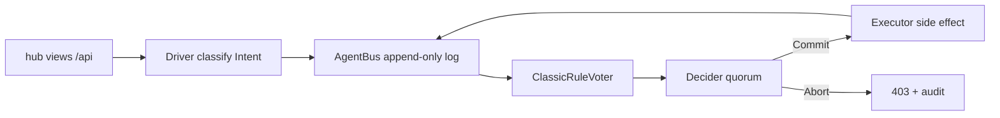

# LogAct privacy gate (parked)

Deferred. Do **not** start until lightweight OSS is done. Based on [LogAct (arXiv:2604.07988)](https://arxiv.org/abs/2604.07988): intents are durable and visible **before** execution; pluggable voters can abort; the log is the audit trail.

See also: [lightweight-oss.md](lightweight-oss.md) (ships first).

## Idea

Dirty-slate LogAct layer for hudhub: every sensitive side effect is Intent → Vote → Commit before it runs. Classic **rule** voters for hard guarantees; LLM voter stubbed / off by default. Collocated in one Node process for v1 (not a LogClaw rewrite).



## Security boundary (what must Intent)

| Intent kind | Today’s hot path | Risk |
|---|---|---|
| `egress.openrouter` | `agent-server.js`, `live-server.js`, `draft-server.js`, `/api/transcribe`, `/api/activity/cursor-context` | Local text/audio/images leave the machine |
| `egress.fetch` | `/api/proxy` | Arbitrary URL fetch |
| `pii.read.chatdb` / `pii.read.network` / `pii.read.contacts` | `network-data.js` | iMessage / CRM / AddressBook |
| `pii.read.sauron` | `sauronExec` in `server.js` | Clipboard / activity / reentry |
| `local.write.sensitive` | `drafts.json`, `crm.json`, `message-profile.json`, `letters/*`, `live-session.jsonl` | Persist PII next to the repo |

Benign static page serves and empty `notes.json` reads stay outside the bus.

## Implementation sketch

### 1. AgentBus — `logact/agentbus.js`

- Append-only store under `~/.hudhub/agentbus.jsonl` (override `HUDBUS_PATH`); never in the git tree
- Typed entries: `Mail`, `Intent`, `Vote`, `Commit`, `Abort`, `Result`, `Policy`
- Sync `append` + `read` + `tail`; in-process `poll` via EventEmitter

### 2. Policy + Classic voter — `logact/policy.example.json` + `logact/voters.js`

- Default-deny unknown intent kinds
- `egress.openrouter`: whitelist routes; deny payloads tagged with chat.db / CRM dumps unless `allowPiiEgress: true` (default **false**)
- `egress.fetch`: host allowlist (empty → deny)
- `pii.read.*`: only when feature flags enabled; still logged
- Decider: `require_all_classic` (AND); Abort → HTTP 403

### 3. Gate — `logact/gate.js`

```js
await gate.run(intent, async () => { /* existing side effect */ });
```

Wire: wrap OpenRouter fetches, `/api/proxy`, `networkData.*`, `sauronExec`, sensitive writes.

### 4. Audit

- `GET /api/logact/tail?n=50` (localhost only)
- README: how to read the bus, flip `allowPiiEgress`

## Not in v1

- Multi-process isolation of Executor vs Voters
- Semantic recovery / LLM introspection voters
- Pure state-machine rewrite of agents

## Verify (when built)

- Default policy: draft/agent with CRM context → Abort in bus
- Plain “make a list” agent still Commits
- `~/.hudhub/agentbus.jsonl` grows; repo stays clean of PII
